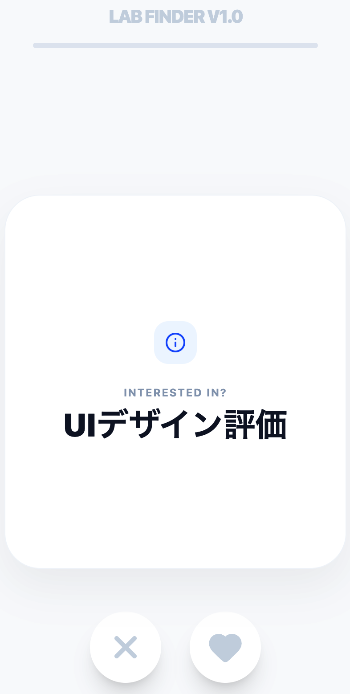

# FUN Lab Finder (2026年度版) 🎓✨

**「102ページの研究テーマ資料、全部読むのは大変じゃないですか？」**

FUN Lab Finderは、公立はこだて未来大学の膨大な卒業研究テーマ一覧（情報システムコース）から、あなたの興味にぴったりの研究室を直感的なスワイプ操作で見つけるためのマッチングアプリです。

## スクリーンショット


## 🚀 デモ
[こちらからアプリを試せます](https://ayaniimi213.github.io/lab-finder/)

## 🌟 主な特徴
- **直感的なUI**: Tinderスタイルのスワイプ操作で、提示されるキーワードに「興味がある（右）」か「興味がない（左）」を直感的に選択。
- **46研究室を網羅**: コース内教員だけでなく、コース外の関連教員も含めた全46研究室のデータを収録。
- **マッチングアルゴリズム**: スワイプデータに基づき、研究室ごとのマッチ度をスコア化。上位5つの研究室を、一致したキーワードと共に提示。
- **モバイルフレンドリー**: PCはもちろん、スマホからでも快適に操作可能。

## 🛠 使用技術
- **Frontend**: React (Vite)
- **Styling**: Tailwind CSS (v4)
- **Animation**: Framer Motion
- **Icons**: Lucide React
- **Deployment**: GitHub Pages

## 📊 データについて
本アプリで使用しているデータは、公立はこだて未来大学 教務委員会発行の「2026年度卒業研究テーマ一覧（情報システムコース）」より抽出したものです。102ページにわたるPDFから、各研究室の特徴を表すキーワードを独自に抽出・整理して使用しています。

## 💻 ローカルでの開発方法

```bash
# リポジトリをクローン
git clone https://github.com/<あなたのユーザー名>/lab-finder.git

# フォルダに移動
cd lab-finder

# 依存関係のインストール
npm install

# 開発サーバーの起動
npm run dev
```

## 📝 開発の背景
学生のスワイプで要望を入力するサービスをつくりたいという話から、それってTinderみたいだね、それなら研究室決定の時にも使えるのではという話になり、昼休みの30分クオリティでとりあえず作ってみました。

## 👤 作成者
Ayahiko Niimi
公立はこだて未来大学
